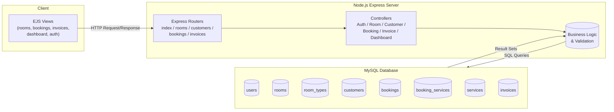
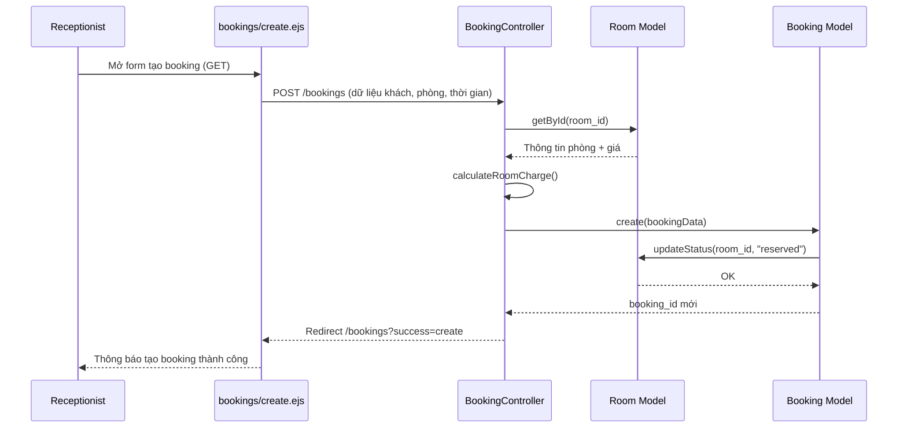
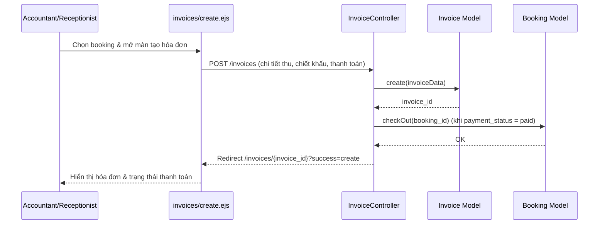
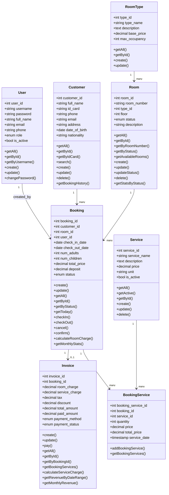

# UML Diagrams for Hotel Management System

Tệp này tổng hợp các sơ đồ UML dưới dạng Mermaid để bạn có thể mở, chụp hình và chèn vào báo cáo HTML.  
Đề xuất sử dụng [https://mermaid.live/](https://mermaid.live/) hoặc mở trực tiếp trong IDE hỗ trợ Mermaid để xuất hình độ phân giải cao.

---

## 1. Sơ đồ kiến trúc mức cao

---

## 2. Sequence Diagram – UC1: Tạo Booking

---

## 3. Sequence Diagram – UC2: Lập & Thanh toán Hóa đơn

---

## 4. Class Diagram – Lớp dữ liệu cốt lõi

---

## 5. Ghi chú sử dụng

- Có thể chỉnh sửa lại tên tác nhân hoặc ghi chú trong biểu đồ để khớp với tài liệu tiếng Việt hoàn chỉnh trước khi chụp hình.
- Nếu cần thêm sơ đồ Use-case hoặc Activity, sao chép cấu trúc trên và điều chỉnh Mermaid tương ứng.
- Khi chụp hình, nên bật chế độ “Dark” hoặc “Light” theo phong cách của báo cáo để đồng nhất thị giác.

---

Chúc bạn hoàn thiện báo cáo thuận lợi!
